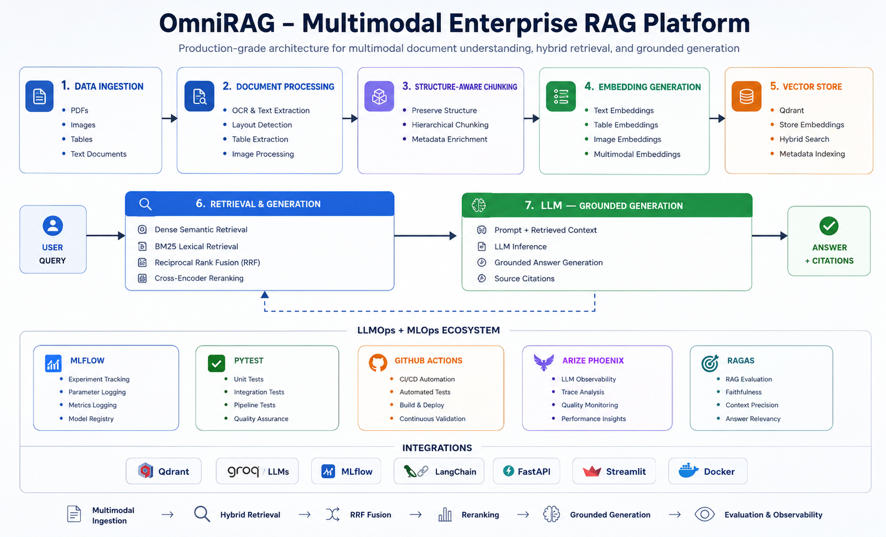
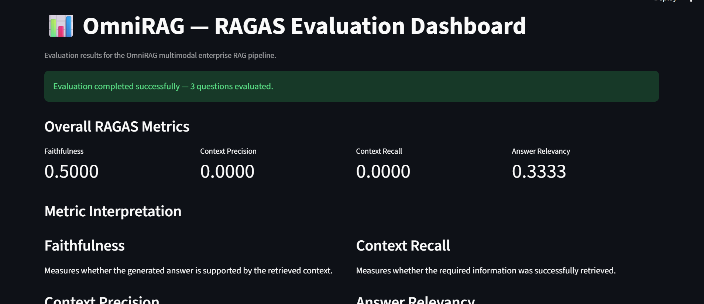
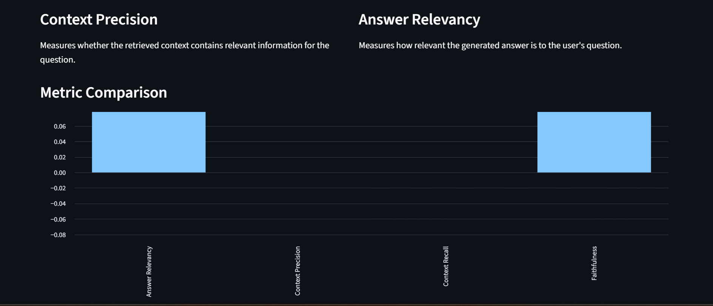
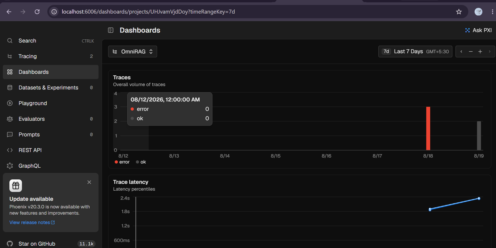
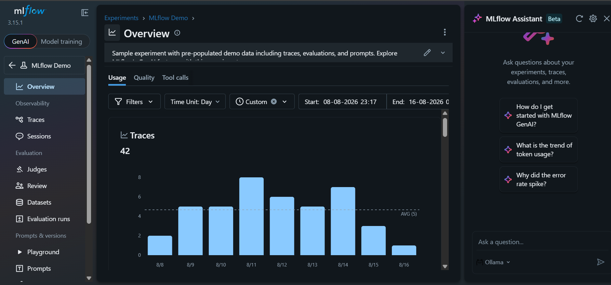

# 🚀 OmniRAG — Multimodal Enterprise RAG Platform

OmniRAG is a production-oriented **multimodal Retrieval-Augmented Generation (RAG) platform** designed for intelligent document understanding, semantic search, grounded question answering, and enterprise knowledge retrieval.

The platform processes enterprise documents using **Unstructured.io**, generates embeddings, stores them in **Qdrant**, and combines **dense semantic retrieval with BM25 lexical search**. Retrieved results are merged using **Reciprocal Rank Fusion (RRF)** and refined using **cross-encoder reranking** before being passed to Groq-hosted LLMs for grounded answer generation.

The platform also integrates **LLMOps and MLOps practices** for evaluation, observability, testing, experiment tracking, and CI/CD.

---

## 🌐 Live Dashboards

[](http://localhost:8501/)

[](http://localhost:6006/projects?timeRangeKey=7d)

[](http://localhost:5000/)

🔗 [📚 Open FastAPI Docs](http://localhost:8000/docs)

## ✨ Key Highlights

* 📄 Multimodal document ingestion
* 🧩 Structure-aware document chunking
* 🔢 Text, table, and image embeddings
* 🗄️ Qdrant vector database
* 🔎 Dense semantic retrieval
* 🔤 BM25 lexical retrieval
* 🔀 Reciprocal Rank Fusion (RRF)
* 🎯 Cross-encoder reranking
* 🤖 Grounded LLM answer generation
* 📚 Source and page-level citations
* 📊 RAGAS evaluation
* 🔭 Arize Phoenix observability
* 📈 MLflow experiment tracking
* 🧪 PyTest automated testing
* ⚙️ GitHub Actions CI/CD
* 🐳 Docker-based deployment
* 🔐 Secure authentication and role-based access

---

# 🚀 Key Features

| Feature                        | Description                                                                     |
| ------------------------------ | ------------------------------------------------------------------------------- |
| 📄 **Multimodal Ingestion**    | Processes PDF content including text, tables, and images                        |
| 🧩 **Intelligent Chunking**    | Creates retrieval-ready chunks while preserving document structure and metadata |
| 🔢 **Embeddings**              | Converts document content into vector representations                           |
| 🗄️ **Vector Search**          | Qdrant-powered semantic retrieval                                               |
| 🔤 **BM25 Retrieval**          | Keyword and exact-term lexical retrieval                                        |
| 🔀 **RRF Fusion**              | Combines dense and lexical retrieval rankings                                   |
| 🎯 **Cross-Encoder Reranking** | Reranks retrieved candidates based on query relevance                           |
| 🤖 **LLM Generation**          | Generates grounded answers using Groq-hosted LLMs                               |
| 📚 **Citations**               | Returns source document and page metadata                                       |
| 📊 **RAGAS**                   | Evaluates RAG quality                                                           |
| 🔭 **Phoenix**                 | Provides end-to-end RAG tracing and observability                               |
| 📈 **MLflow**                  | Tracks experiments, configurations, and runtime metrics                         |
| 🧪 **PyTest**                  | Automated unit and integration testing                                          |
| 🔄 **GitHub Actions**          | Continuous integration and automated testing                                    |
| 🐳 **Docker**                  | Containerized and reproducible deployment                                       |

---

# 🏗️ System Architecture

OmniRAG follows a multimodal RAG architecture combining document processing, structure-aware chunking, multimodal embeddings, hybrid retrieval, reranking, grounded generation, and LLMOps/MLOps monitoring.

## Architecture Overview



---

# 🔄 RAG Pipeline

The complete OmniRAG pipeline consists of the following stages:

```text
User uploads a document
        ↓
Unstructured.io extracts document elements
        ↓
Content is chunked with metadata
        ↓
Embeddings are generated
        ↓
Chunks are stored in Qdrant
        ↓
User submits a natural-language query
        ↓
Dense semantic retrieval
        +
BM25 lexical retrieval
        ↓
Reciprocal Rank Fusion (RRF)
        ↓
Cross-Encoder Reranking
        ↓
Relevant Context Construction
        ↓
Groq-hosted LLM
        ↓
Grounded Answer Generation
        ↓
Source Citations
        ↓
Phoenix Tracing + MLflow Tracking
        ↓
RAGAS Evaluation
```

---

# 📚 Document Processing Pipeline

## 1. Document Ingestion

Users upload enterprise documents through the OmniRAG interface.

Supported content includes:

* PDF documents
* Text
* Tables
* Images

## 2. Document Processing

**Unstructured.io** extracts structured elements from uploaded documents.

The processing pipeline handles:

* Text extraction
* Table extraction
* Image extraction
* Layout information
* Document metadata

## 3. Structure-Aware Chunking

Instead of blindly splitting documents into fixed-size chunks, OmniRAG preserves useful document structure.

The chunking strategy considers:

* Document hierarchy
* Section boundaries
* Metadata
* Table content
* Semantic relationships

## 4. Embedding Generation

Content is transformed into vector representations for semantic retrieval.

The platform supports:

* Text embeddings
* Table embeddings
* Image embeddings
* Multimodal representations

## 5. Vector Storage

Generated embeddings and metadata are stored in **Qdrant** for efficient similarity search.

---

# 🔎 Hybrid Retrieval

OmniRAG combines two complementary retrieval strategies.

## Dense Semantic Retrieval

Dense retrieval identifies content based on semantic similarity.

This allows the system to retrieve relevant information even when the query and document use different terminology.

## BM25 Lexical Retrieval

BM25 provides keyword-based retrieval and is particularly useful for:

* Exact terms
* Names
* IDs
* Technical terminology
* Numbers
* Domain-specific keywords

## 🔀 Reciprocal Rank Fusion

Results from dense retrieval and BM25 retrieval are combined using **Reciprocal Rank Fusion (RRF)**.

```text
Dense Semantic Search
        │
        │
        ▼
   Dense Results
        │
        │
        ├───────────────┐
        │               │
        │               │
        ▼               ▼
   RRF Rank Fusion ← BM25 Search
        │
        ▼
Combined Candidates
        │
        ▼
Cross-Encoder Reranking
        │
        ▼
Relevant Context
```

This improves retrieval robustness by combining semantic understanding with exact-term matching.

---

# 🎯 Cross-Encoder Reranking

After hybrid retrieval, candidate chunks are passed through a cross-encoder reranker.

The reranker evaluates:

```text
User Query ↔ Retrieved Chunk
```

and assigns relevance scores.

This allows OmniRAG to refine the initial retrieval results before sending context to the LLM.

---

# 🤖 Grounded Answer Generation

The final retrieved context is passed to a Groq-hosted LLM.

The generation process follows:

```text
User Query
    ↓
Retrieved Context
    ↓
Prompt Construction
    ↓
Groq-hosted LLM
    ↓
Grounded Answer
    ↓
Source Citations
```

The goal is to generate answers based on retrieved evidence rather than unsupported information.

---

# 📚 Source Citations

OmniRAG returns source information alongside generated responses.

Citations can include:

* Source document
* Page number
* Retrieved chunk
* Relevant metadata

This improves answer traceability and allows users to verify generated responses against the original documents.

---

# 📊 RAGAS Evaluation

OmniRAG evaluates RAG quality using **RAGAS**.

## Evaluation Metrics

| Metric            |      Score |
| ----------------- | ---------: |
| Faithfulness      | **0.4333** |
| Context Precision | **0.3333** |
| Context Recall    | **0.8889** |
| Answer Relevancy  | **0.5573** |

## Evaluation Interpretation

### Context Recall — 0.8889

A high Context Recall score indicates that the retrieval pipeline is generally successful at retrieving the information required to answer the question.

### Faithfulness — 0.4333

The Faithfulness score indicates that there is room for improvement in ensuring that generated answers remain fully supported by the retrieved context.

### Context Precision — 0.3333

The Context Precision score indicates opportunities to improve retrieval filtering and reranking so that more relevant context is prioritized.

### Answer Relevancy — 0.5573

Answer Relevancy measures how closely the generated response aligns with the user's question.

---

# 🔭 Observability & LLMOps

## Arize Phoenix

Arize Phoenix provides observability across the RAG pipeline.

Phoenix can trace:

* Query execution
* BM25 refresh
* Dense retrieval
* Hybrid retrieval
* RRF fusion
* Reranking
* Context construction
* LLM generation
* Citation generation
* Latency
* Errors

This enables debugging and performance analysis across individual RAG components.

---

# 📈 MLflow Experiment Tracking

MLflow is used to track experiments and runtime information.

Tracked information includes:

* Model
* Query
* Retrieval configuration
* Retrieval latency
* Generation latency
* Total latency
* Number of retrieved chunks
* Citation information
* RAGAS evaluation metrics

This enables systematic comparison and experimentation across different RAG configurations.

---

# 🧪 Testing

OmniRAG uses **PyTest** for automated testing.

Testing covers:

* Unit tests
* Integration tests
* Pipeline tests
* Retrieval components
* API functionality
* Quality validation

The test suite is integrated into the CI/CD pipeline.

---

# ⚙️ CI/CD

GitHub Actions automates the software delivery workflow.

```text
Code Push
    ↓
GitHub Actions
    ↓
Install Dependencies
    ↓
Run Tests
    ↓
Quality Checks
    ↓
Build Application
    ↓
Continuous Validation
```

This provides continuous validation of changes and helps maintain project reliability.

---

# 🐳 Docker Deployment

OmniRAG uses Docker for reproducible and isolated deployment.

## Core Services

* FastAPI application
* Qdrant vector database
* Arize Phoenix observability
* MLflow tracking

## Build API Image

```bash
docker build -t omnirag-api .
```

## Start Services

```bash
docker compose up -d
```

## Check Running Containers

```bash
docker compose ps
```

## Health Check

```bash
curl http://localhost:8000/health
```

---

# 🛠️ Technology Stack

| Category                | Technologies                   |
| ----------------------- | ------------------------------ |
| **Language**            | Python                         |
| **Frontend**            | Streamlit                      |
| **API**                 | FastAPI                        |
| **RAG**                 | Retrieval-Augmented Generation |
| **Document Processing** | Unstructured.io                |
| **Vector Database**     | Qdrant                         |
| **Lexical Retrieval**   | BM25                           |
| **Rank Fusion**         | Reciprocal Rank Fusion         |
| **Reranking**           | Cross-Encoder                  |
| **LLM**                 | Groq-hosted LLMs               |
| **Evaluation**          | RAGAS                          |
| **Observability**       | Arize Phoenix                  |
| **Experiment Tracking** | MLflow                         |
| **Testing**             | PyTest                         |
| **CI/CD**               | GitHub Actions                 |
| **Containerization**    | Docker                         |
| **Version Control**     | Git & GitHub                   |

---

# 📸 Screenshots


## 📊 RAGAS Evaluation Dashboard

[](https://raw.githubusercontent.com/Kanaka-VY/omnirag/main/assets/ragas-evaluation-dashboard.png)

## 📈 RAGAS Metric Comparison

[](https://raw.githubusercontent.com/Kanaka-VY/omnirag/main/assets/ragas-metric-comparison.png)

## 🔭 Arize Phoenix Observability

[](https://raw.githubusercontent.com/Kanaka-VY/omnirag/main/assets/phoenix-observability-dashboard.png)

## 📈 MLflow Experiment Tracking

[](https://raw.githubusercontent.com/Kanaka-VY/omnirag/main/assets/mlflow-experiment-tracking.png)

---

# 📂 Project Structure

```text
OmniRAG/
│
├── src/
│   ├── api/
│   ├── ingestion/
│   ├── chunking/
│   ├── embeddings/
│   ├── retrieval/
│   ├── reranking/
│   ├── generation/
│   ├── evaluation/
│   └── observability/
│
├── tests/
│
├── assets/
│   ├── omnirag-architecture.png
│   ├── streamlit-ui.png
│   ├── document-upload.png
│   ├── chat-answer.png
│   ├── citations.png
│   ├── phoenix-trace.png
│   ├── mlflow.png
│   ├── ragas-dashboard.png
│   └── github-actions.png
│
├── Dockerfile
├── docker-compose.yml
├── requirements.txt
├── .env.example
└── README.md
```

---

# 🚀 Getting Started

## 1. Clone the Repository

```bash
git clone <your-repository-url>
cd OmniRAG
```

## 2. Create a Virtual Environment

```bash
python -m venv .venv
```

### Windows

```bash
.venv\Scripts\activate
```

### Linux / macOS

```bash
source .venv/bin/activate
```

## 3. Install Dependencies

```bash
pip install -r requirements.txt
```

## 4. Configure Environment Variables

Create a `.env` file based on `.env.example`.

Configure the required:

* Groq API credentials
* Qdrant configuration
* MLflow configuration
* Phoenix configuration
* Embedding configuration

## 5. Start the Application

Start the required services using:

```bash
docker compose up -d
```

Then launch the application according to the project configuration.

---

# 🔐 Security

OmniRAG is designed with enterprise-oriented security considerations including:

* Secure authentication
* Role-Based Access Control (RBAC)
* Environment-based secret management
* Containerized services
* Controlled document access

API keys and credentials should be stored in environment variables and **never committed to GitHub**.

---

# 📊 End-to-End Workflow

```text
                    ┌─────────────────────┐
                    │    User / Admin     │
                    └──────────┬──────────┘
                               │
                               ▼
                    ┌─────────────────────┐
                    │    Streamlit UI     │
                    └──────────┬──────────┘
                               │
                               ▼
                    ┌─────────────────────┐
                    │       FastAPI       │
                    └──────────┬──────────┘
                               │
                ┌──────────────┴──────────────┐
                │                             │
                ▼                             ▼
        Document Pipeline              Query Pipeline
                │                             │
                ▼                             ▼
         Unstructured.io              Dense Retrieval
                │                             │
                ▼                             ▼
       Chunking + Metadata                  BM25
                │                             │
                ▼                             ▼
          Embeddings                    RRF Fusion
                │                             │
                ▼                             ▼
             Qdrant                   Cross-Encoder
                │                             │
                └──────────────┬──────────────┘
                               │
                               ▼
                       Retrieved Context
                               │
                               ▼
                       Groq-hosted LLM
                               │
                               ▼
                       Grounded Answer
                               │
                               ▼
                       Source Citations
                               │
                  ┌────────────┼────────────┐
                  ▼            ▼            ▼
               Phoenix       MLflow       RAGAS
             Observability  Tracking    Evaluation
```

---

# 🎯 Project Goals

OmniRAG was designed to demonstrate how a production-oriented RAG system can combine:

* Multimodal document understanding
* Hybrid information retrieval
* Retrieval optimization
* Grounded LLM generation
* Evaluation-driven development
* LLM observability
* Experiment tracking
* Automated testing
* CI/CD
* Containerized deployment

The objective is to move beyond a basic RAG chatbot toward a **measurable, observable, testable, and production-oriented enterprise RAG platform**.

---


# 👩‍💻 Author

**Kanaka V Y**

Artificial Intelligence & Machine Learning Engineer

### Areas of Interest

* Machine Learning
* Deep Learning
* Generative AI
* Large Language Models
* Retrieval-Augmented Generation
* Computer Vision
* MLOps
* LLMOps

